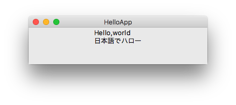

## hello, Tkinter

最初に、よくあるメッセージを出力するだけのプログラムを作成してみます。

myapp/hello.py より
```python
# coding: utf-8 
from hitk import ttk, ui

class HelloApp(ui.App):
  def create_widgets(self, base):
      ttk.Label(base, text=u'Hello,world\n日本語でハロー').pack()

if __name__ == '__main__': HelloApp.run()
```

こちらのコードを実行すると、ダイアログが出現します。

python 2.x では、日本語テキストを含むソースコードは # coding で
文字コードを指定する必要があります。
python 3 でエンコードを utf-8 にする場合は、この指定は不要です。

hitk パッケージに、ユーザコードの記述が最小になるような仕組みが組み込まれていて、
from 〜 import 構文により、そこから　ttk と ui　を取り込んでいます。

python 2.x では ttk の実体はそのまま ttkで、
python 3.x では tkinter.ttk に相当します。

ユーザコードでは通常、ui.App を継承するクラスを定義します。
そして最低限、create_widgets メソッドを定義する必要があります。
パラメータとして self と base　が渡されてきますが、base は親ウィジェットを意味します。
後で説明しますが　base は tk.TopLevel に配置された ttk.Frame です。
この base に、任意の GUIの部品を配置していきます。

ttk.Label はメッセージや画像を表示する部品です。
この例では「hello,world」と、改行して「日本語でハロー」と表示しています。
python2 では日本語テキストを扱う場合は 文字列リテラルに
 u 修飾をつけて、UCS;Unicode String となるようにWidget にテキストを引き渡してください。

ttk.Label オブジェクトは生成しただけでは表示されず、
pack を呼び出すことにより画面に出現するようになります。

表示されるメッセージウィンドウを操作して大きさを変えてみてください。
単純にpack を呼び出すと、部品は上部中央に張り付く感じで配置されます。



最後に定義したクラスの run を呼び出せば、画面にウィンドウが出現します。
run は ui.App に定義されているメソッドで、
その内部で mainloop() を呼び出してイベント処理を行っています。

ウィンドウを閉じる操作を行えば、プログラムの動作は停止します。
macではウィンドウ左上の赤丸ボタン。　Windowsや Linuxでは×ボタンになります。

