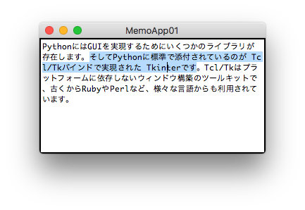

## 素朴なテキストエディタ

次に、素朴なテキスト・エディタの例を示します。

myapp/memo01.py より
```python
from hitk import tk, ui, dialogs

class MemoApp01(ui.App):
  def create_widgets(self, base, rows=15, column=60):
    tk.Text(base, width=column, height=rows,
            undo=1,maxundo=1000).pack(fill='both', expand=1)
```

こちらのコードを実行すると、テキストを編集する領域が現れます。
（実行の手順は後述します。）

こちらにはテキストを保存する機能は組み込んでいないので、
動作を終了したら残念ながら編集内容は失われてしまいます。
ただ テキスト入力のGUI部品としての機能は含まれているため、
その振る舞いを確認することができます。




テキスト編集のためのキー操作はプラットフォームにより異なります。
macOS やLinux は bashやEmacsのキーバインドに似ています。
Windows においては「メモ帳」のキーバインドに似ています。

macOSではコピーと貼り付けは ⌘C や ⌘Vになります。
Windows では Ctrl-C や Ctrl-V ですね。
詳細は　[Appendix IV tk.Textのキーバインド](AppendixIV.md)　を参照ください。　　

実は ttkには複数行テキストを編集するウィジェットは含まれておらず、
代わりに tk に含まれる Textウィジェットを利用します。
tk は python2 においては Tkinter に相当し、python3 においては tkinter  に相当します。

例によって ui.App を継承する形でクラスを定義し、
create_widgets　で部品を作成するコードを記述します。
create_widgetsには、デフォルト値を指定する追加パラメータが定義できます。
デフォルトパラメータでなければエラーが生じます。
この例では　column（桁の文字数）と rows( 行の文字数)　を受け取って、
tk.Text  に引き渡しています。

テキスト操作に限定されますが、なんと tk.TextにはUNDO/REDO の
入力のやり直しの仕掛けが組み込まれています。
この例のように undo=1 と、許容する回数の上限を指定してやるだけで利用できます。
他のGUIツールキットはここまで手軽にいきません。

こちらでもpack  を呼び出していますが、
パラメータとして、fill='both', expand=1 を引き渡しています。
この指定により、ウィンドウをユーザ操作で広げると、
テキスト編集領域も合わせて広がることになります。
（無指定だと先の例のように上部の中央に止まります）

## hitk を利用したアプリの起動

先の myapp/hello.py のように、run() メソッドを呼び出せば ui.App は起動してきますが、
もっと簡単にアプリを起動する仕組みが hitk には組み込まれています。

その仕組みは hitk.launcer.run で実装されています。
apps.txt に定義を追記し、アプリ名を指定して起動する方法になります。

このMemoApp01 を起動するには次のように操作します。
```shell script
$ echo myapp.memo01 >> apps.txt
$ python -m hitk memo01
```

hitk パッケージは動作するときに、 apps.txt を参照します。
apps.txt には、クラス名やモジュール名を含めることができます。
モジュール名を指定すると、それに含まれる ui.Appのサブクラスが認識されるようになります。

パラメータにはクラス名の省略表記を指定します。
クラス名から App を除いて小文字にしたものです。
このパラメータを省略すると、apps.txt  の末尾に追記したモジュールの
末尾のui.App クラスが動作対象として選ばれます。

先の例に従って、myapp/__main__.py を準備しているなら、
hitk　の代わりに myapp でも同様に動作させることができます。

```shell script
$ python -m myapp memo01
```


